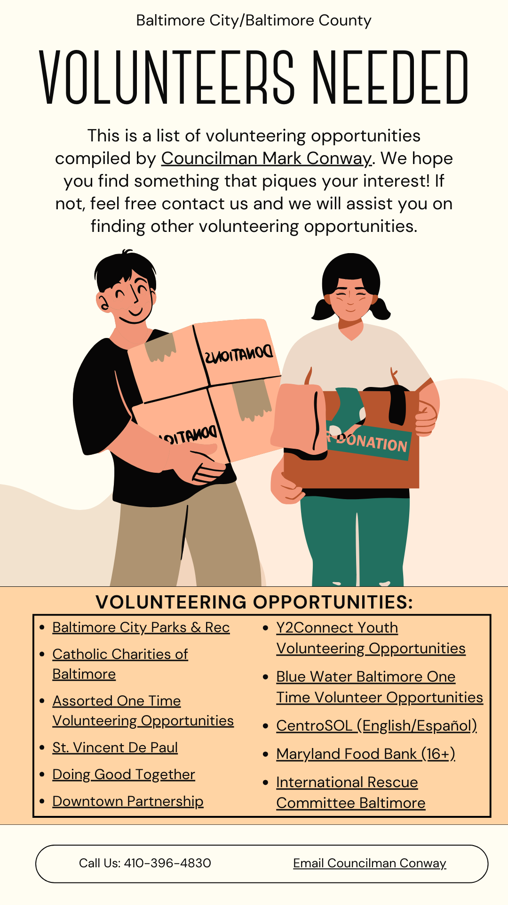
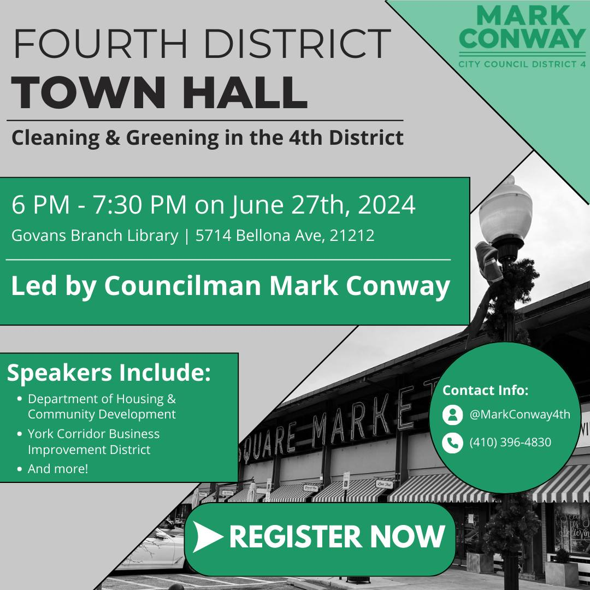

## Table of Contents

### Overview

[How I Got Into Graphic Design](#why-graphic-design)

[What's Next?](#whats-next)

### Councilman Conway Work

[Presentation Features](#mark-conway-presentation-features)

[Presentation Summary](#mark-conway-presentation-quick-summary)

[The Presentation](#mark-conway-presentation)

[Other Work](#other-work-for-the-councilman)

## Why Graphic Design?

I got into graphic design in my junior year of high school because I constantly had to do presentations. Mine would always be comparable to others' presentations, but I knew I could do better. I started getting into both using templates from Canva, and also creating my own templates (not for public use). This led to my presentations becoming a lot better and me gaining an interest in graphic design. I really grew my skills and got a lot more interested during my senior project, where for 6 weeks at the end of my senior year I interned for Baltimore City Councilman Mark Conway, which is where all of my examples will be from.

## What's Next?

I'm not sure right now. I'm continuing to use and better my skills in classes, and whenever a new opportunity comes up to use my graphic design I'll make a post about it!

## Mark Conway Presentation Quick Summary

This first graphic design project is my senior project presentation for my senior project with Baltimore City Councilman Mark Conway. This presentation reflects on my journey working with him and his office. I learned a lot about about government operations, community service, and graphic design. It has a several cool features as well as everything a good presentation needs. Here’s a breakdown of what I included:

## Mark Conway Presentation Features

- **Clickable post-it notes**: These guide you through different topics.
- **Arrows between weeks**: Navigate the timeline of my experience easily and see how everything connects.
- **Clean, minimal graphic design**: Everything is visually organized to make info easy to follow.
- **Photo descriptions**: Added visuals like pictures from a job fair, with context about the event and its significance.
- **Interactive timeline**: Quickly go between topics using the *post-it notes* to get to different slides, the *return* button on each slide to return to its respective week, and the *next week* and *prev week* buttons to move between the six weeks of my project.
- **Highlighted key questions**: Examples of real questions I wrote for Councilman Conway to ask city departments, like improving recycling targets or addressing budget cuts.
- **Takeaway section**: Insights about office dynamics, project flexibility, and government operations.

## Mark Conway Presentation

<iframe src="https://docs.google.com/presentation/d/e/2PACX-1vTf1dauZm4r-_MwqUUQT2U6hfWVMcmwuqM7HfURvwpzPjlPHHAESIHo-tgOT_YSfQ/embed?start=false&loop=true" frameborder="0" width="1920" height="1109" allowfullscreen="true" mozallowfullscreen="true" webkitallowfullscreen="true"></iframe>

## Other Work For The Councilman

### Volunteering Opportunities Poster

The above **"Volunteer Opportunities"** flyer was created because a constituent's mother emailed us asking what their child could do for volunteering. The constituent had been around the house a lot and her mother wanted to get her out and helping the community. I researched several places (listed within the poster) and created this flyer with clickable links to each volunteering opportunity.

At the bottom of the flyer, you'll find contact information for Councilman Conway, including a phone number and an email link for anyone needing help with volunteering or anything else 4th district related.

### Fourth District Town Hall Flyer

The above **"Fourth District Town Hall"** flyer was created for its namesake, the yearly 4th district town hall. Each year Councilman Conway hosts a town hall with his constituents so he can hear out their issues and bring them to the Baltimore City Council.

I again included easy ways to reach out to Councilman Conway via his Twitter handle ([@MarkConway4th](https://x.com/markconway4th)) or phone number (410-396-4830).