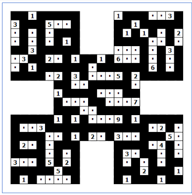

## Table of Contents

[Nurikabe Essay](#nurikabe-a-puzzle-with-islands-rivers-dragonflies-pyramids-and-more)

[Nurikabe Essay Commentary](#nurikabe-essay-commentary)

[Baba Is You Essay](#baba-is-you-flag-is-win)

[Baba Is You Essay Commentary](#baba-is-you-essay-commentary)

## Overview 

I enjoy solving puzzles because of the sense of joy I get from completing a puzzle. It's a lot of work to complete some of these puzzles, and finally finishing ones that I have been working on for hours if not days is amazing. Puzzles also [help brain health](https://www.progresslifeline.org.uk/news-the-benefit-of-puzzles-for-the-brain), keeping dementia at bay. Since I enjoy puzzles so much, I've written a couple essays about them I'll post each one here with a bit of commentary about it afterwards.

## Nurikabe: A Puzzle with Islands, Rivers, Dragonflies, Pyramids, and More!

I suck at geography. I likely couldn’t point to the reservoir near my house on a map of my state. Yet, somehow, I fell in love with this puzzle about mapping islands and rivers! Nurikabe is an N-by-N box—where a few of the tiles are numbered and most are empty—in which the goal is to create one continuous river of blacked out tiles that never has any 2-by-2 boxes of blacked out tiles, and make sure that every numbered tile has its own island—meaning not connected to any other island—of empty tiles with the same number of tiles indicated on the tile. This puzzle can be solved purely using logic, but as no one (except Keanu Reeves) is perfect, I found that this puzzle is best solved using these specific puzzle solving strategies rather than pure logic: “Tak[ing] a dragonfly-eye view” (McKinsey), “Heuristics” (Psych Central), and “Gut Instincts” (Psych Central). 

A dragonfly-eye view is described as “taking in 360 degrees of perception” (McKinsey) and doing this is an extremely important step of solving Nurikabe. As a logic puzzle, Nurikabe has a starting point which is to surround all of the boxes labeled with a one with river tiles, as they are their own islands and cannot have any other empty tiles next to them. After this, the puzzle solver should use their dragonfly-eye view to look for other places where certain things are forced, and not immediately recognizable. Two of the most important things are ‘pyramids’ and areas ‘cornered’ by numbered tiles. Pyramids are what I call 3 numbered tiles where two are on one column and separated by one row, and the third tile one column to the left or right of the other two, on the empty row between them. This forces the third tile mentioned to start its island in one direction, and forces the other two to go in only two directions. This helps the solver find island directions, and they can then manipulate the river to work with these. Cornered areas are a tile or group of tiles that have only one possible path to them as they are cornered by numbered tiles or forced island placements. Figuring out where these are is important as to not accidentally block them off with an island placement. Identifying these types of forced placements helps the puzzle solver find solutions in specific areas of the puzzle and recognize patterns in sections where placements may not initially appear forced.

While taking the dragonfly-eye approach is important and can help the solver get started on the puzzle, Nurikabe requires more than just this. Heuristics—also known as formulaic problem solving—are just as important. Heuristics works best in Nurikabe when paired with intuition and gut instincts. The two best formulas that I have found are ‘reaching’, and anchor placements. Reaching is when the puzzle solver uses a larger number to reach out into areas with not many numbered tiles near them. This works best on larger puzzles, like the 15-by-15 or 20-by-20. To do this efficiently, the puzzle solver should look for areas that other islands cannot reach, or where the other islands nearby that could reach the empty areas are forced to go in another direction. Then the player should draw in possible river setups to see which one makes sure there are no lakes—the formal name for the 2-by-2 box of black tiles mentioned in the first paragraph—leaves space for nearby islands to be formed, and finally has the correct amount of tiles for that island. Reaching allows for quick coverage of a large area of the puzzle and helps to force other nearby islands to face away from the large reaching island. 

The second strategy, anchor placements, is a strategy that relies more on gut instincts, but relies some on pattern recognition as well. After extensive practice with Nurikabe, I've started to recognize certain patterns that often lead to correct placements. When I spot these patterns, I place the corresponding islands and build around those islands to help solve the puzzle. A specific example of an anchor placement is when there is a numbered tile N one column away from the edge, and another numbered tile N+1 tiles away from the first tile. This often means the N size island is built entirely up/down towards the other numbered tile, leaving a 1 tile gap between the two and allowing the river to flow through. This strategy is sort of a last resort, only to be used when you can’t see any forced movements and want to progress the puzzle logically. I call them anchor placements because while not forced, they are places to attempt to anchor your solution off of by forcing other islands to block lakes from forming, or to face away from the newly placed island.

Nurikabe is a puzzle that tests both the intuition and analytical skills of the puzzle solver. It helps the solver learn to quickly see patterns due to the simplicity of the visuals and rules, while simultaneously being complex enough to let the solver sit there and think their way through the entire puzzle if they so wish. This puzzle stuck out to me in particular because when first reading the rules I didn’t understand it whatsoever. My first 5-by-5 Nurikabe took me over 20 minutes trying to figure out what the puzzle wanted, but upon figuring it out I fell in love with the puzzle. The simplicity of possible placements for islands and rivers allows even the most complicated Nurikabes to be solved within 20-30 minutes, while finding those solutions also taxes my brain to the perfect amount. This type of puzzle that combines intuition and analysis, Heuristics and anchor placements, is the type of puzzle I love. 

### Works Cited

- Conn, Charles, and Robert McLean. *Business Problem Solving*, McKinsey, 15 Sept. 2020, [www.mckinsey.com/capabilities/strategy-and-corporate-finance/our-insights/six-problem-solving-mindsets-for-very-uncertain-times](https://www.mckinsey.com/capabilities/strategy-and-corporate-finance/our-insights/six-problem-solving-mindsets-for-very-uncertain-times).

- Des Marais, Saya, MSW. *Problem-Solving Strategies: Definition and 5 Techniques to Try*, Psych Central, 25 July 2016, [psychcentral.com/health/problem-solving-strategies#heuristics](https://psychcentral.com/health/problem-solving-strategies#heuristics).

## Nurikabe Essay Commentary

Nurikabe is a puzzle I found by chance, and these three things really stuck with me:

- Its simplicity
- Its difficulty
- Its terribly described rules

The first two I get into in the essay, but the third I'll talk about here. The site I first found it on, [puzzle-nurikabe.com](https://www.puzzle-nurikabe.com/), has the most incomprehensible ruleset of all time, so much so that my first puzzle (the likes of which I can solve in under 10 seconds now) took me almost 15 minutes to solve, and I completed it out of sheer luck. I spent so much time trying to decipher what things like an `n-omino` were, and how to even ***draw things correctly on the board***. This awful description made me determined to solve the first puzzle, understanding what Nurikabe even was, and then solve the second puzzle, Nurikabe itself.

The hardest Nurikabe I have completed, the October monthly Nurikabe ([Here is the one for November!](https://www.puzzle-nurikabe.com/?size=13)), is pictured below.

### October 2024 Monthly Nurikabe

## [Baba] [is] [You], [Flag] [is] [Win]

Beginning to play Baba Is You is like entering a fever dream. You go from being a human living in a world full of untold rules and regulations to being a pixelated one tile wide rabbit in a 2D tiled world with very specific rules. Baba Is You is a video game that can be found on Steam for $10, and is absolutely worth the price. The game itself is about bending the rules that are given to you in order to win each level. 

In the first level, “Baba Is You”, there are four rules which are made of separate text objects which will be denoted using brackets throughout this essay: [Baba] [is] [You], [Flag] [is] [Win], [Wall] [is] [Stop], and [Rock] [is] [Push]. Baba ([You]) sits in a 3 tile wide corridor made of walls across from the flag, and in between Baba and the flag sit 3 rocks placed in a line. The only information you are given besides this is that you use WASD to move, space to wait, and Z to undo. The goal of Baba Is You, as with most video games, is to win. Whatever [You] are (often Baba) wants to get to whatever [Win] is (often a flag). In this first level, the solution is to simply move to the right, push the rock in your way to the side, and go to the flag. This is the only time a level will be simple. 

The next level, “Where Do I Go?”, immediately scales in difficulty. Baba is in a room made of walls, and the only thing inside that room is the rule [Wall] [is] [Stop]. Additionally, there is another room made entirely of walls with three disconnected text pieces ([Flag], [is], and [Win]) as well as a flag, and outside of the rooms there is the rule [Baba] [is] [You]. [You] are stopped by the walls and stuck in this room, and the flag as well as the ability to win are locked in the next room. This level teaches the player the most fundamental aspect of Baba Is You: To win, you must change the rules. The text boxes that denote the rules can be moved and pushed around as if they are an object that [is] [Push], like the rocks in the first level. The player can push any of the text in the rule [Wall] [is] [Stop], walk through the walls which are now effectively background decoration, make the flag [Win], and step on it. The next level, “Now What Is This?”, is the same level, except the walls are replaced with flags, the [Wall] [is] [stop] rule is replaced by [Flag] [is] [Stop], the loose text has [Flag] replaced by [Baba], Baba in the first room has been replaced by a single wall, and the rule outside is now [Wall] [is] [You]. The way to win is similar, break up the text making the flags stop [You], bring the [is] and [Win] to make the many flags [Win] and step on one of them. 

As the game goes on, the levels get more and more complicated, with more text objects to put between nouns and verbs which include but are not limited to [not], [on], and [has] to allow for more complication. New nouns (and the objects to go with them) like [Keke] (a little red guy) or [Love] (a heart) are introduced to make for more design possibilities, as well as new verbs like [Shut]/[Open] (an object that is [Open] can destroy an object that is [Shut] when they touch) and my personal favorite: [Move]. Any noun that is [Move] will move one tile in the direction it is facing and upon touching a wall or an object that [is] [Stop] it will turn around and move the other way. 

[Move] is one of the two main reasons I still play the game. It takes a puzzle game that requires many minutes or even hours of thinking to solve each level and adds a new element: Timing. Many of the [Move] based levels require the player to set up the noun that is moving in a specific spot and direction so that [You] can reach a certain spot or perform a specific action before the moving noun does what it is set up to do. 

The level “Catch The Thief” starts off with a robot moving at the text [Baba] [is] [You], threatening to disconnect it and make it so there is no longer a [You] in the level. To stop this [You] are required to move the [Baba] [is] [You] text to an unfavorable position, where it’s pressed against a wall and hard to edit. 
In the level “Dim Signal”, the goal of the level is to connect three disconnected [Flag], [Rock], and [Ice] texts to the [Win] using 2 [and]s and an [is] so that the [Flag] [and] [Rock] [and] [Ice] [is] [Win], so then the flag (the only object of those three that is actually in the level) can be used to win. This requires [You] to set up your own robot so it pushes an [and] text across a line of objects that are [Defeat]. While this is happening [You] use the rest of the text provided in the level to push an [is] across that same pool and then walk to the flag before the robot pushes the [and] text too far. If you are off by a few movements, the level will become impossible as the [and] text can no longer be part of the winning text sequence. Levels like these that push the bounds of puzzle games keep me deeply interested as they require me to think in multiple different ways at once. 

When I first began to play Baba is you, I was intrigued by the rapidly scaling difficulty of the puzzles, and also the massive amount of levels there are. In my 90 hours of playtime so far, I have completed nearly 200 levels, and still have over 100 left incomplete. For many of those 100, there is a mechanic of the game that I’m yet to understand or discover, and that’s what brings me back to Baba Is You every time. This is the other reason that I continue to open Baba Is You after so much time: The idea of not fully understanding the game yet. There are times where I’ll play a single level for 20 or 30 minutes and not be any closer to completing it than I was when I first started that day and I love that. Puzzles tend to come easy to me, so when one doesn’t it gets me excited and I rarely wanna stop trying to solve it until it’s done. Baba Is You hits that perfect level of difficulty, where I have to think for so long to solve certain levels but it is so rare that I will look at a level and just think that it looks impossible. And even when there are levels that I thought were impossible like “Deep Pool,” and I always eventually find a solution. It can take me 5+ hours and tens of failed attempts and slight tweaks to my ideas, but if I think hard and long enough I can always win. I play Baba Is You because it is hard, it is fun, and because it always has a solution. For many levels the solution I find may not be the same one that the creator found, or that any other player will find, but as long as [You] gets to [Win], I’m happy.

## Baba Is You Essay Commentary

I have played Baba Is You for over 125 hours now, solving exactly 270 levels in that time. This means per hour I have played (I have spent very little of it [AFK](https://www.grammarly.com/blog/acronyms-abbreviations/afk-meaning/)), I have solved an average of slightly over 2 levels. This game is *hard*, but that's exactly why I love it. The game has enough easy levels for a beginner puzzle solver to get maybe 10-15 hours of playtime, which is a lot for someone who doesn't care too much for puzzles. However past that, the levels become a lot harder. The game introduces more objects and more keywords (that have some very confusing properties). Take [Fall] for example, for some reason it lets you avoid any damage you fall through, or [Auto], which is similar to [Move] but the object will only go in the direction you push it until it hits a wall. Each level deeper I go into the map, the longer it takes me, and I will forever enjoy that about this game. Opening a level ten if not twenty times before finally figuring out a solution is amazing, because each time I don't solve the level adds to the amazing feeling I get when I finally do. 

Below I have put an image of my favorite level, Dim Signal (Museum level F, not Solitary Island Extra 4), which is my favorite because it involves both using move and then making sure to conserve the rest of your text objects so you can push the last [and] into place. I have also put a screenshot of a custom level that I made over a year ago with the goal of making something overly complicated and very difficult to read. My level requires this specific input sequence to not immediately lose due to the level melting, a piece of text turning into Love and destroying you, or the [Win] text being destroyed by the Moon:

  
Click to reveal the input sequence! Don't click if you wish to solve it yourself!

  Up, Right, Down, Right, Down, Right, Down

### Dim Signal (Museum)

[Dim Signal (Museum)](DimSignalF.png)

### My Baba Is You Level

[My Baba Is You Level](REALMYBABA.png)